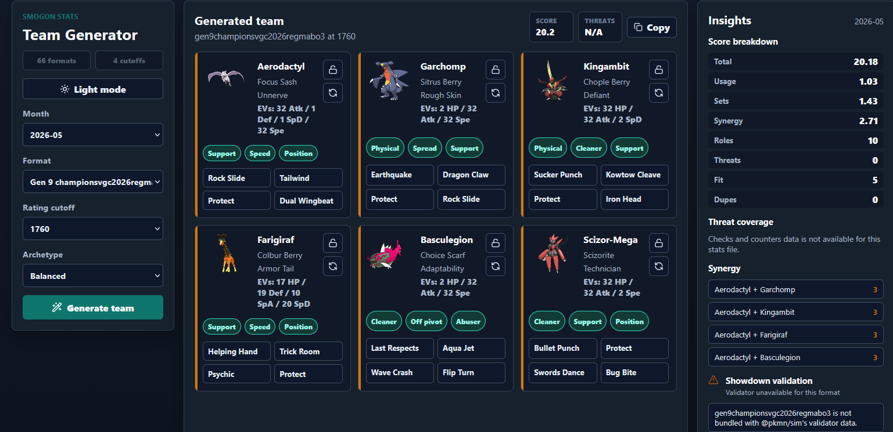

# Stats Based Team Generator

A multi-format Pokemon team generator powered by Smogon usage stats, checks and
counters, teammate data, Smogon analysis sets, and format-aware team scoring.

The app builds Showdown-importable teams, validates them with `@pkmn/sim` when
the selected format is available, and uses different role priorities for singles
and doubles formats.



## Features

- Multi-format Smogon stats browser with month, format, and cutoff selection.
- Team generation from usage, checks/counters, teammate synergy, and role needs.
- Singles-aware hazards, removal, preservation, pivots, and item disruption.
- Doubles-aware speed control, board positioning, spread pressure, and item clause.
- Contextual set selection from stats and Smogon analysis templates.
- Showdown import text with copy buttons and server-side legality validation.
- Dark mode and Pokemon sprites through the `@pkmn` ecosystem.

## Requirements

- Node.js 22 or newer
- npm 10 or newer

## Run Locally

```bash
npm install
npm run dev
```

Open the Vite URL printed by the terminal, usually `http://127.0.0.1:5173`.
The API runs on `http://127.0.0.1:8787` by default.

If port 8787 is already in use:

```bash
$env:PORT=8790
npm run dev
```

## Verify

```bash
npm run ci
npm run audit
```

The CI command runs:

- `npm run lint`
- `npm test`
- `npm run build`

Run `npm run audit` separately for the npm security audit.

## Production Build

```bash
npm ci
npm run build
npm start
```

The server serves `dist/` and the `/api` routes from one process. Set `PORT` to
change the port. Set `HOST=0.0.0.0` when deploying in a container or hosted
environment that needs an external bind address.

## Deployment Notes

This is not a static-only app. The frontend calls same-origin `/api` routes for
Smogon stats discovery, dataset fetching, analysis set loading, and team
validation. The production deployment should run the Node/Express server after
building the Vite frontend.

GitHub Pages is not a good target for the full app because it only serves static
files and cannot run the `/api` server. A Pages deployment would load the UI, but
generation would fail unless you also add a separately hosted API and update the
client/server CORS and API-base configuration.

Recommended deployment targets are Node-capable hosts such as Render, Railway,
Fly.io, a VPS, or a container platform.

Typical host configuration:

- Build command: `npm ci && npm run build`
- Start command: `npm start`
- Node version: `22` or newer
- Environment: `HOST=0.0.0.0`
- Optional environment: `PORT=<platform-provided port>`

For single-process hosting, no extra static-site service is needed. The Express
server serves both the built `dist/` assets and all `/api` routes.

### VPS Deployment: Rocky Linux

These notes assume Rocky Linux 9 or similar, a domain pointed at the VPS, and
Apache httpd as the public reverse proxy. The Node server can stay private on
`127.0.0.1:8787`.

Install system packages:

```bash
sudo dnf update -y
sudo dnf install -y git httpd mod_ssl policycoreutils-python-utils
```

Install Node.js 22 or newer using your preferred source. For example, with `nvm`
or another Node version manager, install Node 22 for the deploy user and confirm:

```bash
node --version
npm --version
```

Create a dedicated app user and deploy directory:

```bash
sudo useradd --system --create-home --shell /bin/bash teamgen
sudo mkdir -p /opt/stats-based-team-generator
sudo chown teamgen:teamgen /opt/stats-based-team-generator
```

Clone, install, and build:

```bash
sudo -iu teamgen
git clone https://github.com/FullLifeGames/StatsBasedTeamGenerator.git /opt/stats-based-team-generator
cd /opt/stats-based-team-generator
npm ci
npm run build
exit
```

Create `/etc/systemd/system/team-generator.service`:

```ini
[Unit]
Description=Stats Based Team Generator
After=network-online.target
Wants=network-online.target

[Service]
Type=simple
User=teamgen
Group=teamgen
WorkingDirectory=/opt/stats-based-team-generator
Environment=NODE_ENV=production
Environment=HOST=127.0.0.1
Environment=PORT=8787
ExecStart=/usr/bin/npm start
Restart=on-failure
RestartSec=5

[Install]
WantedBy=multi-user.target
```

If `npm` is not at `/usr/bin/npm`, replace `ExecStart` with the absolute path
from `command -v npm` for the `teamgen` user.

Enable the service:

```bash
sudo systemctl daemon-reload
sudo systemctl enable --now team-generator
sudo systemctl status team-generator
```

Configure Apache httpd, replacing `teamgen.example.com` with your domain:

```apache
<VirtualHost *:80>
    ServerName teamgen.example.com

    ProxyPreserveHost On
    ProxyPass / http://127.0.0.1:8787/
    ProxyPassReverse / http://127.0.0.1:8787/

    RequestHeader set X-Forwarded-Proto "http"
    ErrorLog /var/log/httpd/team-generator-error.log
    CustomLog /var/log/httpd/team-generator-access.log combined
</VirtualHost>
```

Save that as `/etc/httpd/conf.d/team-generator.conf`, then test and reload:

```bash
sudo apachectl configtest
sudo systemctl enable --now httpd
sudo systemctl reload httpd
```

Open HTTP/HTTPS in the firewall as needed:

```bash
sudo firewall-cmd --permanent --add-service=http
sudo firewall-cmd --permanent --add-service=https
sudo firewall-cmd --reload
```

On SELinux-enabled hosts, allow Apache to proxy to the local Node process:

```bash
sudo setsebool -P httpd_can_network_connect 1
```

For HTTPS, install and run Certbot with the Apache plugin, or terminate TLS at
your VPS provider/load balancer. After TLS is configured, keep the Node service
bound to `127.0.0.1`; only Apache should be public.

To deploy updates:

```bash
sudo -iu teamgen
cd /opt/stats-based-team-generator
git pull --ff-only
npm ci
npm run build
exit
sudo systemctl restart team-generator
```

## Data Sources

- `https://www.smogon.com/stats` for usage, chaos, teammate, and checks/counters
  data.
- `@pkmn/smogon` for processed Smogon analysis set templates.
- `@pkmn/sim` for Showdown-style team validation.
- `@pkmn/img` for Pokemon sprites.

Fetched Smogon data is cached server-side for the local process to keep the app
responsive and polite to upstream services.

## License

MIT. See [LICENSE](LICENSE).

This is an unofficial fan project. Pokemon, Smogon, and Pokemon Showdown are
owned by their respective trademark and copyright holders.
